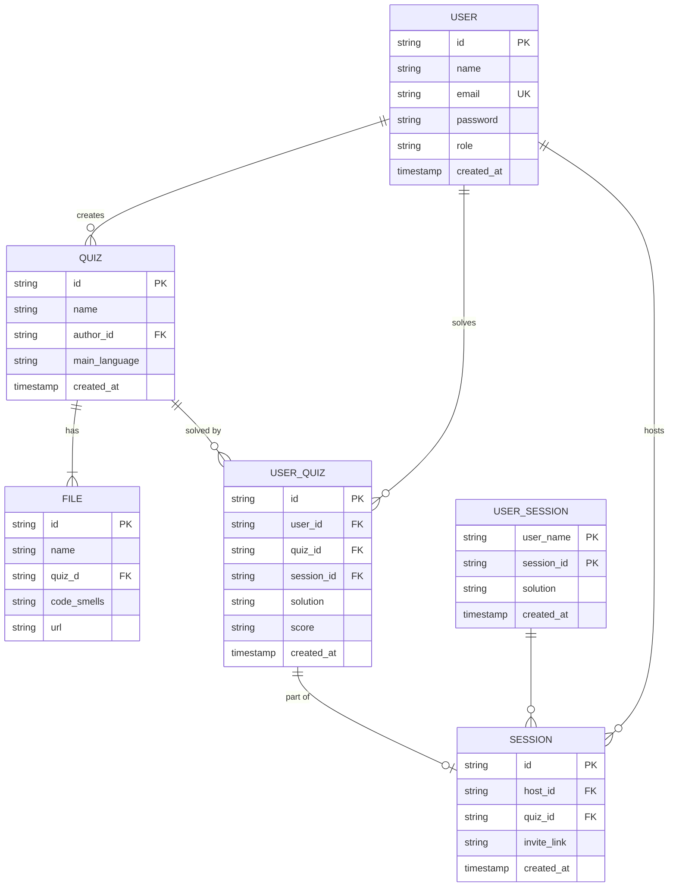

# Ceramicy-IO

## Getting Started

To just run the backend app, the only command you have to execute is:
```shell
make build
```


## Database schema


```mermaid
erDiagram
    QUIZ {
        string id PK
        string name
        string author_id FK
        string main_language
        timestamp created_at
    }
    
    FILE {
        string id PK
        string name
        string quiz_d FK
        string code_smells
        string url
    }
    
    USER {
        string id PK
        string name
        string email UK
        string password
        string role
        timestamp created_at
    }
    
    USER_QUIZ {
        string id PK
        string user_id FK
        string quiz_id FK
        string session_id FK
        string solution
        string score
        timestamp created_at
    }
    
    
    SESSION {
        string id PK
        string host_id FK
        string quiz_id FK
        string invite_link
        timestamp created_at
    }
    
    USER_SESSION {
        string user_name PK
        string session_id PK
        string solution
        timestamp created_at
    }
    
    
    QUIZ ||--|{ FILE : "has"
    USER ||--o{ QUIZ : "creates"
    USER ||--o{ USER_QUIZ : "solves"
    QUIZ ||--o{ USER_QUIZ : "solved by"
    USER ||--o{ SESSION : "hosts"
%%    SESSION ||--o{ QUIZ : ""
    USER_QUIZ ||--o| SESSION : "part of"
    USER_SESSION ||--o{ SESSION : ""
    
    
```