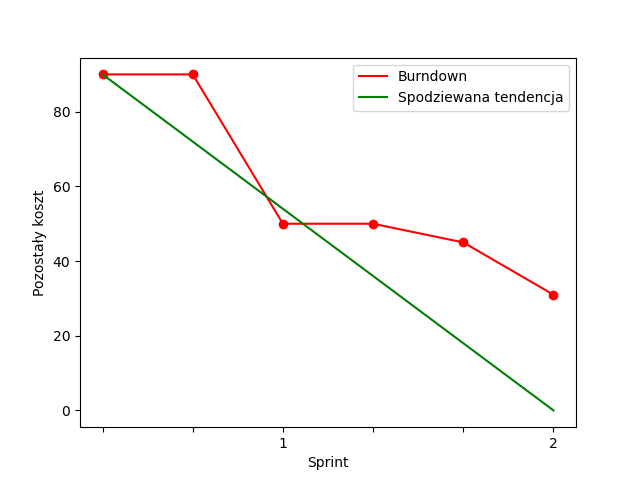

# Ceramicy-IO

# Run Book
To run the app follow the below instructions, first you need to start the backend and the frontend in two separate terminals according to chapters `Backend` and `Frontend`.

### CLIENT
To enter the application as a client, open the address provided in frontend's terminal console in your web browser with sufix `/`
(for ex. http://172.20.0.2:5173/Ceramicy-IO/)

As a client you will be able to:
- enter your name 
- see available quizzes
- attend those quizzes

Attend prefered quizzes and have fun, good luck!

### ADMIN
To enter the application as an administrator, open the address provided in frontend's terminal console in your web browser with sufix `/#/admin/`
(for ex. http://172.20.0.2:5173/Ceramicy-IO/#/admin/)

As a client you will be able to:
- see current quizz sessions
- add new quiz

To add a new quiz, you need to prepere: 
- .zip directory with all files you want to add 
- .json file with existing smells and list of smells you want the users to choose from(details in chapter `Required JSON format to add new quiz`)

Remember to create only valuable and entertaining quizzes!

-------------------------------------------------------------------

## Backend

For backend development, follow the steps below to set up a consistent environment for local development.

### Create a `.env` file

Copy the content of  `.env.example` and adjust the values as needed.
The `docker-compose` file will automatically load the environment variables from the file.
If you want to run the application without `Docker` you can use `direnv` or load the environment variables manually.

```shell
source .env
```

### Run the database and the application

All you need to do is run the following command:

```shell
make build
```

-------------------------------------------------------------------

## Frontend

For frontend development, follow the steps below to set up a consistent environment for local development.

### Setup Environment

#### To build the container image and replace/add `node_modules` installed from within the container, run:

```shell
make build
```

##### Start Local Server
```shell
make up
```

##### Interactive Shell Session
```shell
make shell
```

##### Tests, linter, type-checking and formatter:
```shell
make task
```

-------------------------------------------------------------------

## Required JSON format to add new quiz
```json
{
    "smell_types": ["Unnecessary Comment", "Logic Error", "Incorect Typing"],
    "files": [
        {
            "file_path": "path",
            "smells": [
                {"start": 5, "end": 5, "type": "Unnecessary Comment"},
                {"start": 3, "end": 9, "type": "Logic Error"}
            ]
        },
        {
            "file_path": "path2",
            "smells": [
                {"start": 1, "end": 3, "type": "Unnecessary Comment"},
                {"start": 8, "end": 10, "type": "Unnecessary Comment"}
            ]
        },
        {
            "file_path": "path3", 
            "smells": []
        }
    ]
}
```

-------------------------------------------------------------------

## Points scoring system:

- base point value is the amount of code smells
- for every missing smell -> -1 point.
- for every 'extra'(not correct) smell -> -1 point.
- no negative points

-------------------------------------------------------------------

## Definition of done

- At least one person must review before merging
- Depending on the priority of the task, the number of people involved in the review varies - no strict criteria.
- After each pull request, additional information to the rest of the team about its completion - if there is no review after a day, another message should be sent to the team.
- Pull requests must be tested
- Pull request needs to be merged

-------------------------------------------------------------------

## Database schema


# Burndown Chart
