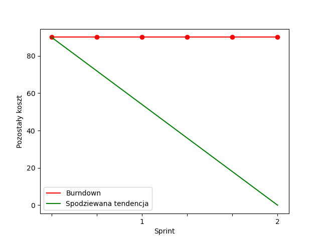

# Ceramicy-IO

## Getting Started

# Backend Development

For backend development, follow the steps below to set up a consistent environment for local development.

## Create a `.env` file

Copy the content of  `.env.example` and adjust the values as needed.
The `docker-compose` file will automatically load the environment variables from the file.
If you want to run the application without `Docker` you can use `direnv` or load the environment variables manually.

```shell
source .env
```

## Run the database and the application

All you need to do is run the following command:

```shell
make build
```

# Frontend Development

For frontend development, follow the steps below to set up a consistent environment for local development.

## Setup Environment

#### To build the container image and replace/add `node_modules` installed from within the container, run:

```shell
make build
```

#### Start Local Server
```shell
make up
```

#### Interactive Shell Session
```shell
make shell
```

#### Tests, linter, type-checking and formatter:
```shell
make task
```

## Definition of done

- Przed zmergowaniem co najmniej jedna osoba musi ocenić
- W zależności od priorytetu zadania zmienna ilość osób uczestniczących w ocenie - brak ścisłych kryteriów.
- Po każdym pull requeście dodatkowa informacja o jego wykonaniu - w razie braku oceny po upływie dnia, ponowna wiadomość do zespołu.
- Pull request musi przechodzić testy
- Pull request musi być zmergowany

## Database schema


# Burndown Chart

