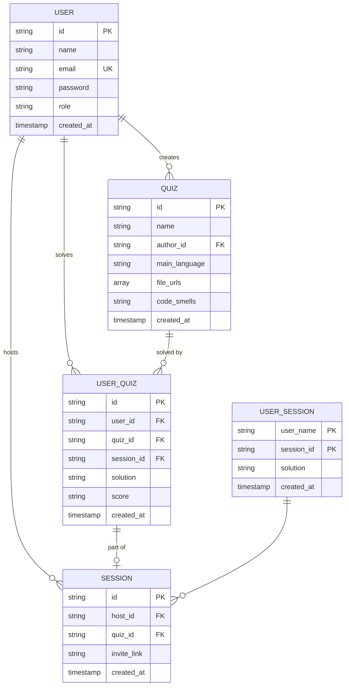

# Ceramicy-IO

## Getting Started

To just run the backend app, the only command you have to execute is:
```shell
make build
```

## Definition of done

- Przed zmergowaniem co najmniej jedna osoba musi ocenić
- W zależności od priorytetu zadania zmienna ilość osób uczestniczących w ocenie - brak ścisłych kryteriów.
- Po każdym pull requeście dodatkowa informacja o jego wykonaniu - w razie braku oceny po upływie dnia, ponowna wiadomość do zespołu.
- Pull request musi przechodzić testy
- Pull request musi być zmergowany

## Database schema


